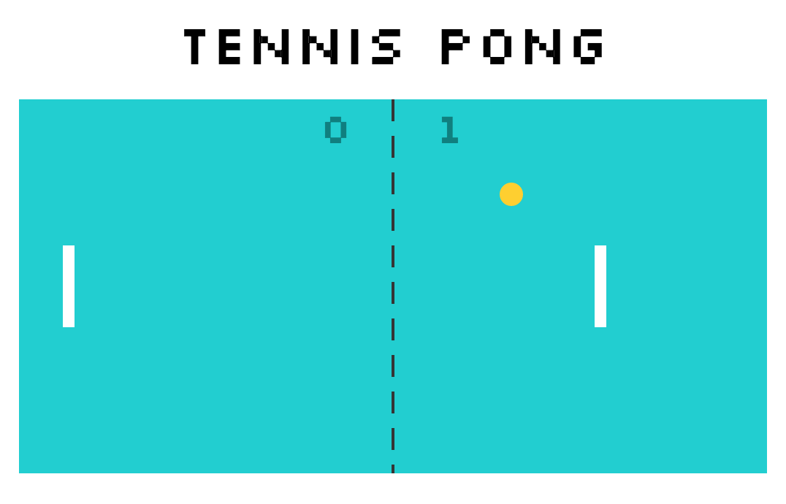

# Pong Game

A basic pong game using SVGs.

## Setup

**Install dependencies:**

`> npm i`

**Run locally with Webpack Dev Server:**

`> npm start`

**Build for production:**

`> npm run build`

## Keys

- spacebar: pause

**Player 1:**

- w: up
- s: down
- a: left
- d: right

**Player 2:**

- ↑ : up
- ↓: down
- ←: left
- →: right

**Aim of the game:**

First player to reach 5 points win.
